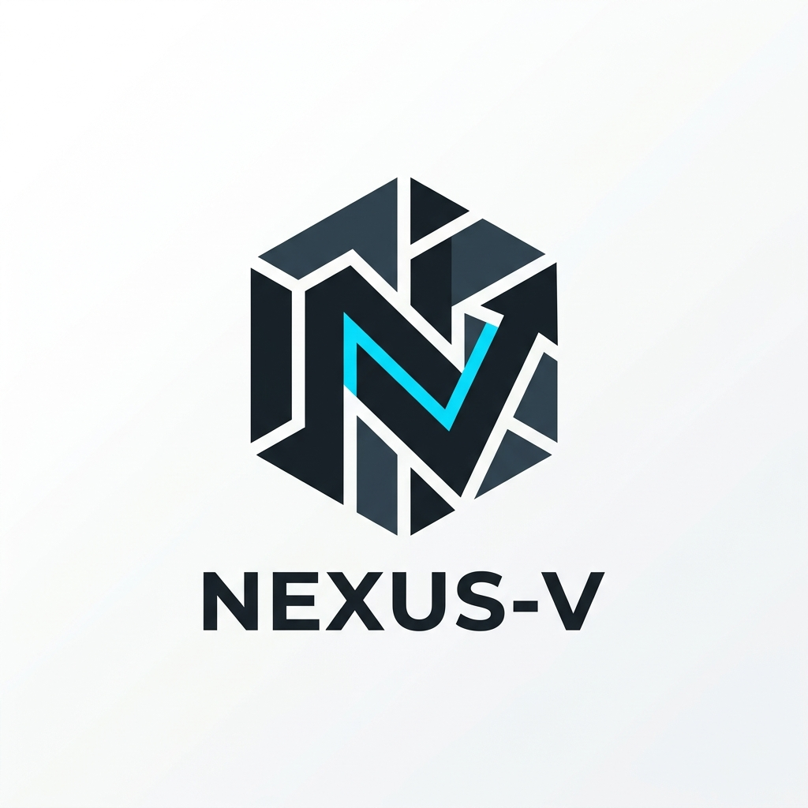

#  Nexus-V for VS Code

**Professional-grade scaffolding engine, integrated directly into your workspace.**

Nexus-V is the flagship orchestration tool for the Still Systems ecosystem. This extension brings the power of the Nexus-V engine to your Activity Bar, allowing you to scaffold, manage, and audit projects without leaving VS Code.

## 🚀 Key Features

- **Activity Bar Explorer**: A dedicated sidebar for managing your Nexus-V projects and environment health.
- **Project Control Dashboard**: One-click project generation with full support for template variants and optional features.
- **Environment Diagnostics**: Run the "Nexus Doctor" directly from the sidebar to ensure your system is perfectly configured.
- **Concurrent Engine**: Blazing-fast project generation powered by the high-performance Nexus-V Go engine.

## 🛠️ Commands

- **Nexus-V: New Project**: Launch the interactive scaffolding flow.
- **Nexus-V: Run Doctor**: Check your environment health and project manifest integrity.
- **Nexus-V: Refresh**: Sync your project view with the latest local configuration.

## 🧱 About Still Systems

Nexus-V is engineered for real-world conditions. We prioritize **Durability**, **Clarity**, and **Performance**.

Learn more at [github.com/stillsystems/nexus-v](https://github.com/stillsystems/nexus-v)

---
🧱 **Still Systems** — Modern developer tooling engineered for real-world conditions.
